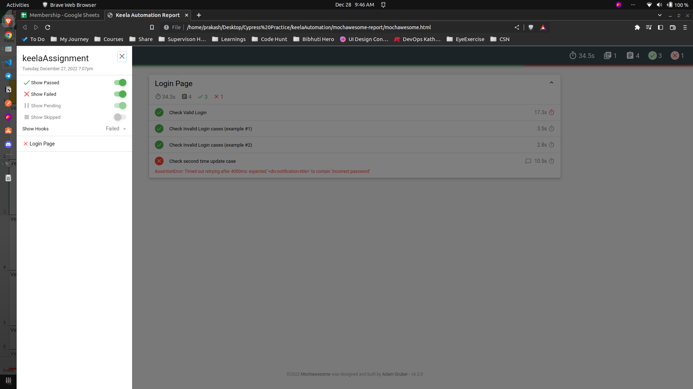

# Keela Automation

## Steps for installation
 - Install node in your machine if you do not have it. 
    - *Note: Make sure that the version of node is above 14*
 - Clone repo from https://github.com/PrakashDahal/keelaAutomation.git
   - `git clone https://github.com/PrakashDahal/keelaAutomation.git` 
 - Go inside the repo
   - `cd keelaAutomation`
 - Install cypress and its packages
   - `npm install`

---

## To see the automation test steps
  - Check `.feature` files inside `cypress/e2e/features`

---

## Run the automation tests
 -  Run automation in headed mode with Full HTML report
    -  `npm start`
    -  HTML report will be available here `mochawesome-report/mochawesome.html`
 -  Run automation in headless mode without HTML report 
    -  `npm run start:headless`
 -  Open the UI of the cypress and execute the test on your own
    -  `npm run ui`

*Note: Check the HTML report inside mochawesome-report*
